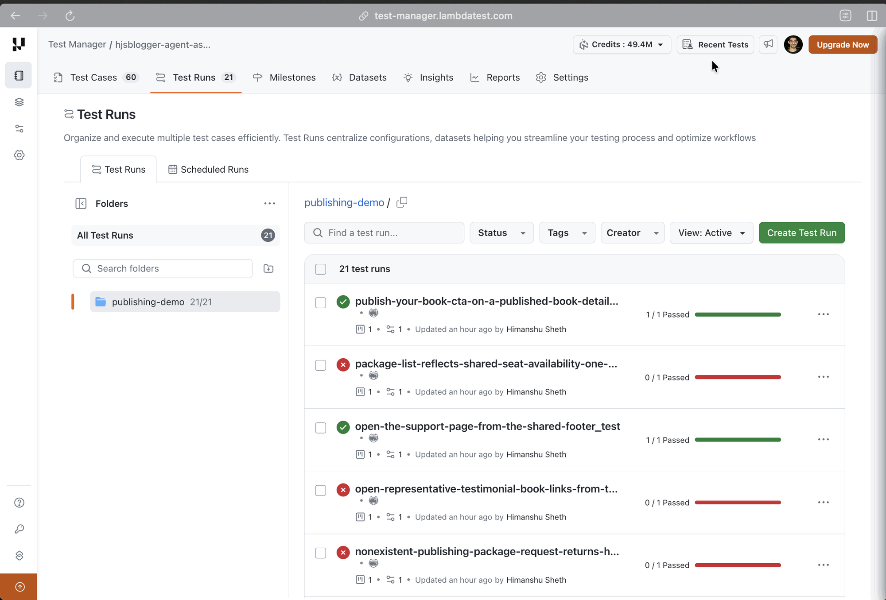
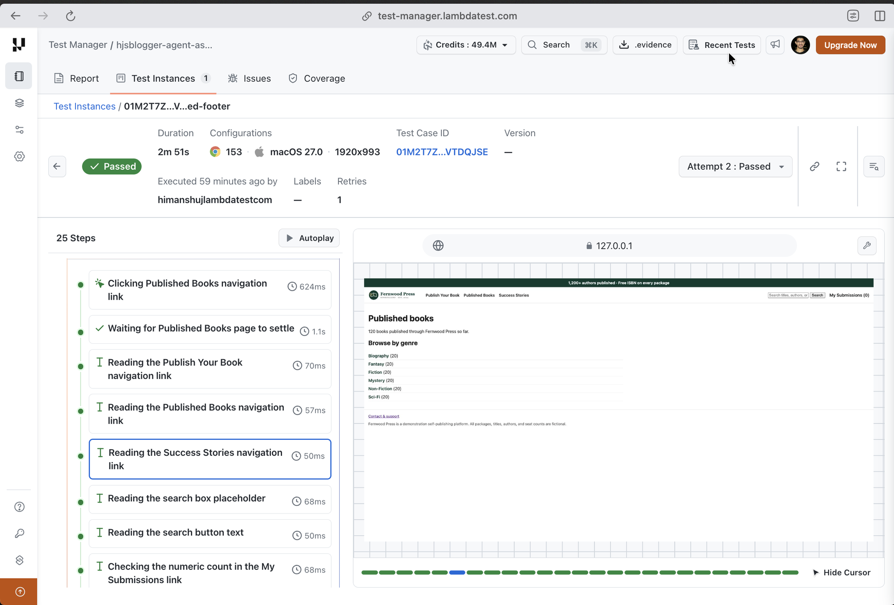

# Fernwood Press — Agentic Assurance Demo

A GitHub Actions pipeline that turns a **requirements document** into **designed tests**,
**executed proof**, and a **coverage verdict** — with no hand-written test code anywhere in
the repo. Every stage is [kane-cli](https://www.testmuai.com/support/docs/kane-cli-assurance/).

The app under test is **Fernwood Press**, a synthetic self-publishing platform that lives
in [`website/`](website/) and is started by the runner itself. Authors compare publishing
packages, submit a manuscript into one, claim a limited monthly onboarding seat, and track
or withdraw the submission; anyone can browse and search a 120-book catalog of titles
already published through the platform.

> This demo uses kane-cli's **Assurance** commands (`context`, `design`, `cover`,
> `maintain`), which are the web-UI testing surface. Rook is a different product, for
> conversational and API agents — it is not used here.

---

## The three stages

```
requirements/book-publishing-website.md        ← the only source of truth
        │
        │  kane-cli context ingest + extract + review
        ▼
   context graph (.context/)  →  10 use-cases
        │
        │  kane-cli design tests --use-case <uc> --max N
        ▼
  .testmuai/tests/*_test.md   →  acceptance criteria, scenarios, 1:1 tests
        │
        │  kane-cli testrun run  (one execution, one sealed pack)
        ▼
  *.evidence                  →  L1-validated, published to Test Manager
        │
        │  kane-cli cover --from <pack> gaps --rollup strict
        ▼
  coverage ribbon  →  designed % × proven %  →  gate + PR comment
```

| Stage | Job | What it produces |
|---|---|---|
| 1 · Assurance | `assurance` | A committed context graph and a set of designed `*_test.md` files |
| 2 · Evidence | `evidence` | One sealed `.evidence` pack for the whole suite, L1-validated |
| 3 · Coverage | `coverage` | The two-axis ribbon, a pass/fail gate, and a PR comment |

The pipeline is [`.github/workflows/publishing-assurance-evidence.yml`](.github/workflows/publishing-assurance-evidence.yml).

### Test Manager and execution

Each `kane-cli testrun run` publishes its sealed evidence pack to Test Manager. Every
designed test shows up as a test run in the project folder, with its pass/fail status:



Opening a run shows the test instance: duration, browser and OS configuration, attempts,
and the step-by-step execution with a screenshot of the app at each step:



---

## Setup

### 1. Required secrets

Set these four repository secrets (**Settings → Secrets and variables → Actions**):

| Secret | What it is | Where to find it |
|---|---|---|
| `LT_USERNAME` | TestMu AI / LambdaTest username | [Account settings](https://accounts.lambdatest.com/detail/profile) |
| `LT_ACCESS_KEY` | TestMu AI / LambdaTest access key | Same page — "Access Key" |
| `TESTMUAI_PROJECT_ID` | Test Manager project the evidence packs publish into | `kane-cli projects list` |
| `TESTMUAI_FOLDER_ID` | Test Manager folder inside that project | `kane-cli folders list` |

With the CLI already authenticated locally, `kane-cli config show` prints the
`project_id` and `folder_id` currently bound to your profile — those are the two ids.

```bash
gh secret set LT_USERNAME           --body "<username>"
gh secret set LT_ACCESS_KEY         --body "<access-key>"
gh secret set TESTMUAI_PROJECT_ID   --body "<project-id>"
gh secret set TESTMUAI_FOLDER_ID    --body "<folder-id>"
```

> **Why the project and folder are bound as a separate step.** The composite action
> calls `kane-cli config project <id>` and `kane-cli config folder <id>` *after*
> `kane-cli login`, rather than passing `--project-id` / `--folder-id` as login flags.
> The login flags do not reliably bind the ids to the active profile, and an unbound
> profile means the sealed pack never lands in the Test Manager dashboard — the run
> goes green while the buyer-facing artifact silently goes missing. See
> [`.github/actions/setup-kane/action.yml`](.github/actions/setup-kane/action.yml).

### 2. Run it

The workflow runs on pushes and PRs that touch `requirements/**`, `.testmuai/tests/**`
or `website/**`, on a weekday schedule, and on demand:

```bash
gh workflow run "Fernwood Press · Assurance & Evidence" \
  -f max_pairs=6 -f coverage_threshold=80 -f force_design=false
```

| Input | Default | Meaning |
|---|---|---|
| `max_pairs` | `6` | Max scenario+test pairs designed per use-case. Caps deliverable size, **not** credits. |
| `coverage_threshold` | `80` | Minimum **proven** coverage % before the build fails. |
| `force_design` | `false` | Redesign use-cases that already have a live design. |

---

## Running it locally

```bash
# 1. Start the platform (installs Flask, waits for /health)
bash scripts/serve_website.sh          # http://127.0.0.1:5050

# 2. Requirements -> use-cases -> designed tests
kane-cli config set-url http://127.0.0.1:5050
REQ_GLOB='requirements/*.md' MAX_PAIRS=6 AUTO_APPROVE=true bash scripts/assurance.sh

# 3. Test data, then execute the suite into one sealed pack
python3 scripts/test_data.py provision
find .testmuai/tests -name '*_test.md' | sort > members.txt
python3 scripts/test_data.py check members.txt
kane-cli testrun run $(cat members.txt) --name "Fernwood local" --parallel 1 --headless

# 4. Coverage
PACK=$(find .testmuai/evidence -name '*.evidence' | head -1)
kane-cli cover --from "$PACK" gaps --rollup strict
python3 scripts/coverage_gate.py --json coverage.json --table coverage.txt --threshold 80
```

`scripts/assurance.sh` runs on bash 3.2, so it works on stock macOS as well as on the
Ubuntu runner.

---

## What's in here

```
requirements/book-publishing-website.md   The source of truth. Change this and the graph re-opens.
.github/actions/setup-kane/action.yml     Install kane-cli, auth, bind TMS project/folder, find Chrome.
.github/workflows/…-evidence.yml          The 3-stage pipeline.
scripts/assurance.sh                      Stage 1: ingest → extract → review → design.
scripts/serve_website.sh                  Start the sample app and block until /health is green.
scripts/test_data.py                      provision / check the {{variables}} the suite needs.
scripts/coverage_gate.py                  Turn the coverage ribbon into a job summary and a gate.
test-data/publishing.json                 Non-secret test data (books, genres, packages, seats).
.testmuai/context.md                      Tells the authoring agent which variable a step means.
.testmuai/tests/                          Designed tests + their recorded steps. Generated, committed.
website/                                  The Fernwood Press Flask app under test.
```

### Two behaviors of the sample app that shape the suite

- **Onboarding seats are a global, process-wide pool.** A seat claimed by any visitor is
  gone for every visitor until it is withdrawn; the pool only resets when the app
  restarts. Starter has 6 seats, Standard 4, Premium 2, Author's Choice exactly 1.
  Submission tests therefore use Starter, withdraw what they submit, and the suite runs
  with `--parallel 1` so two members cannot race for the same seat.
- **There is no sign-in.** Identity is the browser session cookie and nothing else, so
  there are no account credentials to provision — which is why `scripts/test_data.py`
  needs no secrets, unlike its retail counterpart.

---

## Swapping in a real site

The pipeline is not tied to the sample app. To point it at a real deployment:

1. **Rewrite `requirements/book-publishing-website.md`** (or add your own file next to
   it — `REQ_GLOB` is `requirements/*.md`). This is the only content that decides what
   gets tested. Rename it to match your product.
2. **Change `APP_URL`** in the workflow `env:` block to your environment's URL, and
   **delete the `Start the Fernwood Press platform` step** from the `evidence` job —
   a hosted site needs no runner-side server. You can drop `scripts/serve_website.sh`
   and the `website/` directory entirely.
3. **Replace `test-data/publishing.json`** with your own non-secret data, and update the
   `{{variable}}` table in `.testmuai/context.md` so the authoring agent knows which
   variable each step's prose refers to.
4. **If your site has authentication**, add the account as repository secrets and
   provision them in `scripts/test_data.py` — mark the password
   `{"value": …, "secret": true}` so it is masked in logs. The retail demo this one is
   adapted from ([jayakumar331/retail-assurance-demo](https://github.com/jayakumar331/retail-assurance-demo))
   shows that shape.
5. **Reset the graph.** The committed `.context/` describes Fernwood Press. Delete it and
   let the first run rebuild, or re-point an existing source with
   `kane-cli maintain reconcile --from <new.md> --source-id <id>`, which records the
   version move and triages what the change broke instead of silently re-extracting.
6. **Re-check `--parallel`.** Serial execution here is a consequence of the shared seat
   pool. A site without that constraint can raise it once every member is a pure replay.

### When requirements change

Don't re-ingest. `kane-cli maintain reconcile` does the version move *and* triages the
fallout into ADD / MODIFY / ARCHIVE rows:

```bash
kane-cli maintain reconcile --from requirements/book-publishing-website.md \
  --source-id book-publishing-website --mode agent
```

---

## Reading a failure

A red member is diagnosed from the evidence pack, not from the run summary. Download the
`fernwood-evidence-<run>` artifact, then:

```bash
unzip -o <pack>.evidence -d pack/
cat pack/tests/*/failure.yaml        # kane-cli's own root-cause records
kane-cli evidence serve <pack>.evidence   # the full pack in a browser
```

`failure.yaml` carries kane-cli's triage — which step failed, against which acceptance
criterion, and what it observed. `website.log` is attached to the same artifact and is
the place to look when a member failed for a reason the browser could not see, such as a
500 or a traceback.
